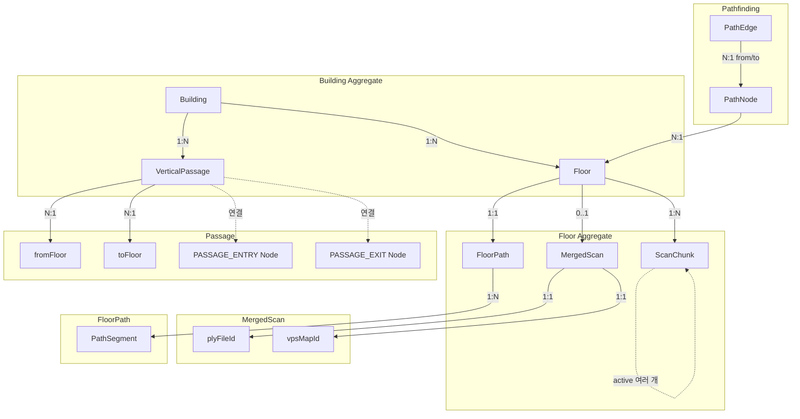
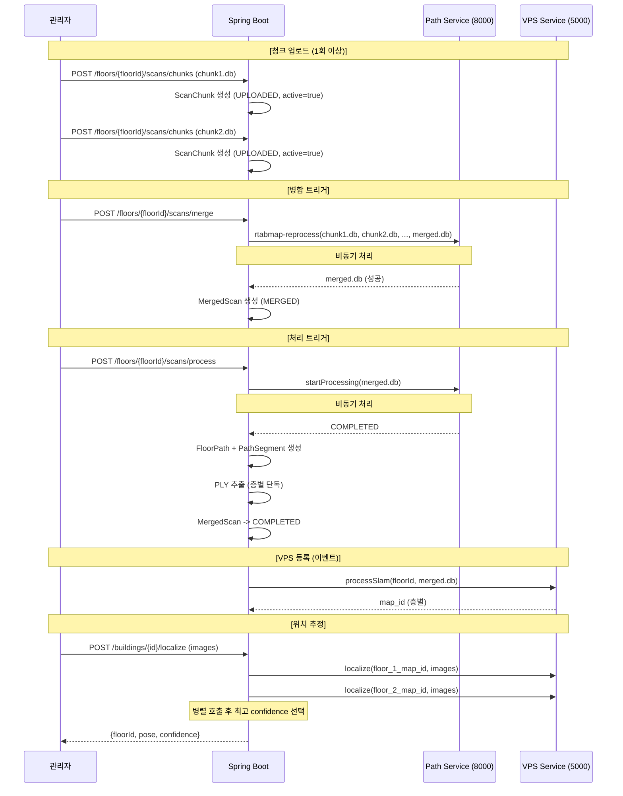
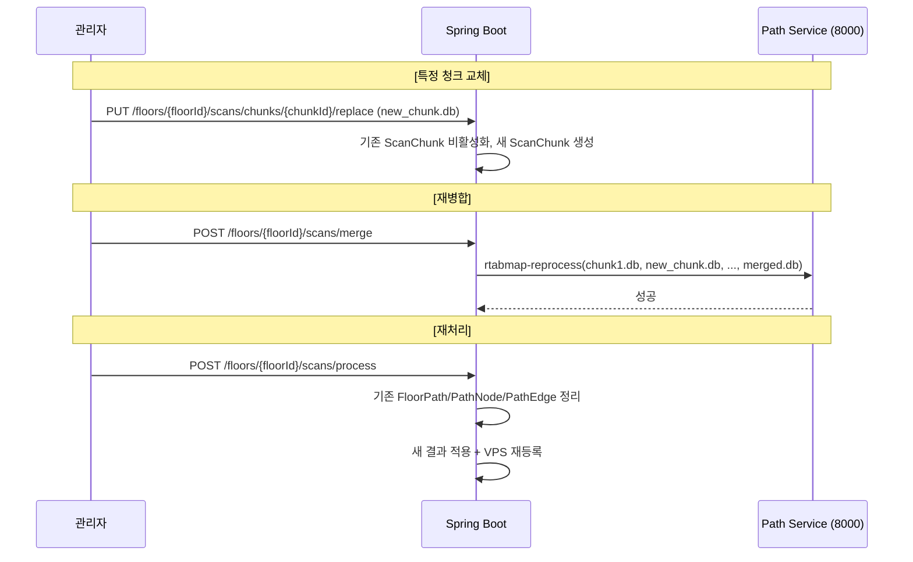
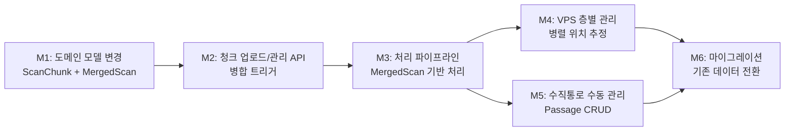

# 00. Master Plan: 층별 청크 분할 업로드/병합 기반 스캔 관리 체계

> **Backlink:** 없음 (최상위 문서)
> **Status:** Proposed
> **Last Updated:** 2026-03-24

---

## 1. Problem Context

### 1.1 현재 상태

현재 시스템은 **건물 단위 스캔** 모델이다. 하나의 .db 파일에 건물 전체를 스캔하고, Python 서비스가 자동으로 층을 분리하며, VPS 서비스는 건물 ID 단위로 SLAM 맵을 관리한다.

```
Building --1:N--> ScanSession (건물 전체 스캔)
Building --1:N--> Floor (자동 생성)
```

### 1.2 핵심 문제

| 문제 | 영향도 | 설명 |
|------|--------|------|
| 전체 재스캔 필요 | 높음 | 1개 층의 실내 구조가 변경되어도 건물 전체를 다시 스캔해야 함 |
| 대형 층 스캔 불가 | 높음 | 한 층이 매우 넓은 경우 한 번에 스캔하기 물리적으로 어려움 |
| 층 분리 정확도 한계 | 높음 | Z-range 기반 자동 층 분리는 복잡한 구조(메자닌, 반층 등)에서 오류 빈발 |
| VPS 전체 재등록 | 중간 | 한 층이 변경되어도 건물 전체 VPS 맵을 재생성해야 함 |
| 수직통로 자동 감지 불안정 | 중간 | 스캔 품질에 따라 계단/엘리베이터 감지가 불안정 |
| 부분 갱신 불가 | 중간 | 일부 영역만 변경되어도 전체를 재스캔/재처리해야 함 |

### 1.3 제약 조건

| 구분 | 내용 |
|------|------|
| Time | 졸업 프로젝트 일정 내 완료 필요 |
| Tech | Python 서비스(port 8000), VPS 서비스(port 5000)의 API 변경 최소화 |
| Compatibility | 기존 pathfinding, POI, 그래프 편집 기능과의 호환성 유지 |
| Architecture | Spring Boot DDD 아키텍처 규칙 준수 (모듈 간 이벤트 통신) |

---

## 2. 변경 목표

**건물 단위 스캔 -> 층별 청크 분할 업로드 + 서버 병합 체계로 전환**

```
AS-IS: Building --1:N--> ScanSession (건물 전체)
TO-BE: Building --1:N--> Floor --1:N--> ScanChunk (부분 스캔)
                               --0..1-> MergedScan (병합 결과)
```

### 핵심 달성 요건

1. 관리자가 **층을 지정하여** 여러 개의 .db 청크 파일을 업로드할 수 있다
2. 서버에서 청크들을 **rtabmap-reprocess로 병합**하여 단일 .db를 생성한다
3. 특정 청크만 **교체 후 재병합**할 수 있다 (부분 업데이트)
4. 단일 청크 업로드도 **동일 플로우로 처리** (병합 스킵)
5. VPS가 **층별 독립 맵**을 관리하며, 위치 추정 시 전체 층 병렬 매칭 후 최고 confidence 선택
6. 수직통로는 **관리자가 수동 설정** (자동 감지 제거)

---

## 3. Architecture Overview

### 3.1 변경 후 도메인 관계



### 3.2 청크 업로드/병합/처리 파이프라인



### 3.3 부분 업데이트 플로우



---

## 4. Sub-Plan Index

| 번호 | 문서 | 내용 | 상태 |
|------|------|------|------|
| 01 | [01_domain_model.md](./01_domain_model.md) | 도메인 모델 변경 상세 설계 (ScanChunk, MergedScan) | Proposed |
| 02 | [02_api_design.md](./02_api_design.md) | API 엔드포인트 설계 (청크 CRUD, 병합, 처리) | Proposed |
| 03 | [03_processing_pipeline.md](./03_processing_pipeline.md) | 처리 파이프라인 변경 상세 (병합 + 처리) | Proposed |
| 04 | [04_vertical_passage.md](./04_vertical_passage.md) | 수직통로 수동 관리 설계 | Proposed |
| 05 | [05_migration.md](./05_migration.md) | 마이그레이션 및 호환성 전략 | Proposed |

---

## 5. Milestones



| Milestone | 예상 소요 | 완료 조건 (DoD) |
|-----------|----------|-----------------|
| M1 | 2일 | ScanChunk, MergedScan 엔티티 작성, Floor 관계 설정, 기존 ScanSession 제거, 테스트 통과 |
| M2 | 2일 | 청크 업로드/삭제/교체 API 동작, 청크 목록 조회 가능 |
| M3 | 3일 | 병합 트리거 -> Python rtabmap-reprocess 호출 -> MergedScan 생성, 처리 트리거 -> FloorPath 생성, PLY 추출, 단일 청크 병합 스킵 동작 |
| M4 | 2일 | VPS 층별 맵 등록, 병렬 localize 후 최고 confidence 층 반환 |
| M5 | 2일 | 수직통로 CRUD API 동작, 자동 감지 코드 제거, PathNode 연결 정상 |
| M6 | 1일 | Flyway 마이그레이션 스크립트 작성, 기존 ScanSession 데이터를 ScanChunk로 전환 |

---

## 6. Risks & Constraints

| 리스크 | 발생 확률 | 영향 | 대응 방안 |
|--------|----------|------|----------|
| Python 서비스의 rtabmap-reprocess 호출 실패 | 중간 | 높음 | 청크 간 overlap 부족이 주 원인. 실패 시 어떤 청크 쌍이 연결 불가인지 에러 메시지 파싱하여 관리자에게 안내 |
| 대형 .db 파일 병합 시간 | 높음 | 중간 | 비동기 처리 + 진행률 폴링. 타임아웃 충분히 설정 (30분 이상) |
| Python 서비스가 건물 전체 .db 기준으로 설계됨 | 높음 | 높음 | 층별 .db(병합 결과)는 이미 단일 층 데이터이므로 기존 API 그대로 사용 가능 (층 분리 로직 스킵) |
| VPS 서비스 API 변경 필요 | 중간 | 중간 | processSlam에 floor 식별자 추가 필요. VPS 측 변경 범위 사전 확인 |
| 기존 ScanSession 데이터 마이그레이션 | 높음 | 중간 | 기존 ScanSession을 ScanChunk 1개 + MergedScan 1개로 변환 |
| 병렬 VPS 호출 성능 | 중간 | 낮음 | CompletableFuture 병렬 호출, timeout 설정으로 관리 |
| 수직통로 자동 감지 제거 시 기존 데이터 | 낮음 | 낮음 | 기존 VerticalPassage 데이터 유지, 관리자 확인 후 수동 재설정 가능 |
| 청크 파일 저장소 용량 | 중간 | 중간 | 비활성 청크/이전 MergedScan의 주기적 정리 정책 필요 |

---

## 7. 설계 원칙

1. **Floor가 스캔의 주인이다:** ScanChunk와 MergedScan은 Floor에 종속되며, Building은 Floor를 통해 간접 참조한다.
2. **청크는 여러 개, 병합 결과는 하나:** 한 Floor에 active ScanChunk는 N개 가능하지만, MergedScan은 최대 1개이다.
3. **병합은 명시적 트리거:** 청크 업로드만으로 자동 병합하지 않는다. 관리자가 병합을 명시적으로 트리거한다.
4. **단일 청크 최적화:** 청크가 1개인 경우 병합을 스킵하고 해당 청크를 곧바로 MergedScan으로 사용한다.
5. **층별 독립 처리:** 한 층의 청크 교체/재병합이 다른 층에 영향을 주지 않는다.
6. **이벤트 기반 후속 처리:** 병합 완료/처리 완료 이벤트 -> VPS 등록, PLY 추출 등은 이벤트로 트리거.
7. **수직통로는 수동:** 자동 감지를 제거하고 관리자가 명시적으로 설정한다.
