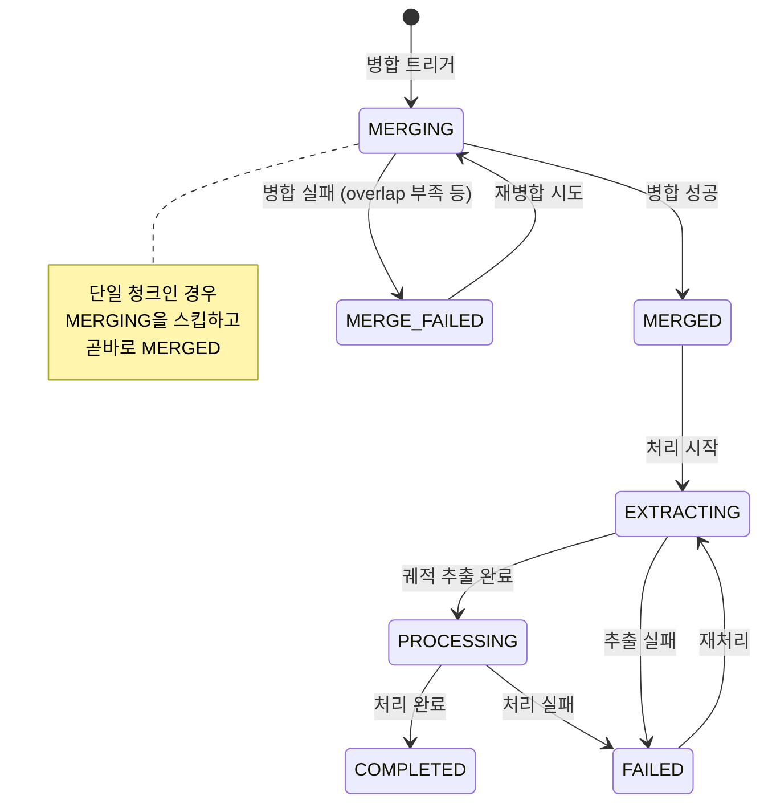
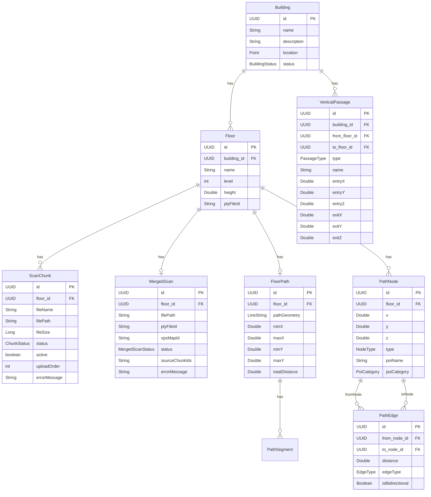

# 01. 도메인 모델 변경 상세 설계

> **Backlink:** [00_master_plan.md](./00_master_plan.md)
> **Status:** Proposed
> **Last Updated:** 2026-03-24

---

## 1. Problem Context

현재 ScanSession은 Building에 직접 종속(ManyToOne)되어 있다. 층별 청크 분할 업로드/병합 체계로 전환하려면 기존 ScanSession 개념을 **ScanChunk**(부분 스캔)와 **MergedScan**(병합 결과)으로 분화해야 하며, 두 엔티티 모두 Floor에 종속된다.

### 제약 조건

- JPA 엔티티가 도메인 모델을 겸한다 (별도 매핑 비용 회피)
- Building -> Floor -> ScanChunk / MergedScan 방향의 cascade 관계 유지
- 기존 PathNode, PathEdge, FloorPath 등의 Floor 참조는 변경 없음
- Rich Domain Model: 상태 전환 로직은 엔티티 내부에 위치

---

## 2. 변경 대상 엔티티

### 2.1 ScanChunk (신규 - 기존 ScanSession 대체)

ScanChunk는 관리자가 업로드한 개별 .db 파일(부분 스캔)을 나타낸다. 한 Floor에 N개의 ScanChunk가 연결된다.

#### 필드 정의

| 필드 | 타입 | 설명 |
|------|------|------|
| id | UUID (PK) | 고유 식별자 |
| floor | Floor (ManyToOne) | 소속 층 |
| fileName | String | 업로드된 파일명 |
| filePath | String | 서버 내 파일 경로 |
| fileSize | Long | 파일 크기 (bytes) |
| status | ChunkStatus | 상태 (UPLOADED, FAILED) |
| active | boolean | 병합 대상 여부, default true |
| uploadOrder | int | 업로드 순서 (병합 시 순서 결정) |
| errorMessage | String | 실패 시 에러 메시지 (nullable) |

#### ChunkStatus Enum

| 상태 | 의미 | 전환 조건 |
|------|------|----------|
| UPLOADED | 파일 업로드 완료, 병합 대기 | 파일 저장 성공 |
| FAILED | 파일 검증 실패 | 파일 유효성 검사 실패 |

#### 도메인 로직 (ScanChunk 내부)

- `activate()`: active = true로 전환. 해당 청크를 병합 대상에 포함.
- `deactivate()`: active = false로 전환. 병합 대상에서 제외.
- `isActive()`: active 상태 반환.

### 2.2 MergedScan (신규)

MergedScan은 ScanChunk들을 rtabmap-reprocess로 병합한 결과 .db 파일을 나타낸다. 한 Floor에 최대 1개의 MergedScan이 존재한다.

#### 필드 정의

| 필드 | 타입 | 설명 |
|------|------|------|
| id | UUID (PK) | 고유 식별자 |
| floor | Floor (OneToOne) | 소속 층 |
| filePath | String | 병합된 .db 파일 경로 |
| plyFileId | String | PLY 캐시 키 |
| vpsMapId | String | VPS 서비스 맵 ID |
| status | MergedScanStatus | 상태 |
| sourceChunkIds | String | 병합에 사용된 ScanChunk ID 목록 (JSON) |
| errorMessage | String | 실패 시 에러 메시지 (nullable) |

#### MergedScanStatus Enum

| 상태 | 의미 | 전환 조건 |
|------|------|----------|
| MERGING | Python 서비스에서 병합 중 | 병합 트리거 |
| MERGED | 병합 완료, 처리 대기 | rtabmap-reprocess 성공 |
| MERGE_FAILED | 병합 실패 | rtabmap-reprocess 실패 (overlap 부족 등) |
| EXTRACTING | Python 서비스에서 궤적 추출 중 | 처리 시작 트리거 |
| PROCESSING | 경로 데이터 생성 중 | 궤적 추출 완료 |
| COMPLETED | 처리 완료, 활성 상태 | 결과 적용 완료 |
| FAILED | 처리 실패 | 에러 발생 |

#### 상태 머신



#### 도메인 로직 (MergedScan 내부)

- `startMerging()`: status -> MERGING. 기존 COMPLETED 상태에서도 재병합 가능.
- `completeMerging(String filePath, String sourceChunkIds)`: status -> MERGED. 파일 경로 갱신.
- `failMerging(String errorMessage)`: status -> MERGE_FAILED.
- `startProcessing()`: MERGED 상태에서만 허용. status -> EXTRACTING.
- `completeProcessing(String plyFileId)`: status -> COMPLETED. plyFileId 갱신.
- `failProcessing(String errorMessage)`: status -> FAILED.
- `updateVpsMapId(String mapId)`: VPS 맵 ID 갱신.
- `canProcess()`: status == MERGED일 때만 true.
- `isCompleted()`: status == COMPLETED.
- `canMerge()`: 어떤 상태에서든 재병합 가능 (기존 결과 교체).

### 2.3 Floor 변경

```
AS-IS:
  Floor -> Building (ManyToOne)
  Floor -> FloorPath (OneToOne)

TO-BE:
  Floor -> Building (ManyToOne) (유지)
  Floor -> FloorPath (OneToOne) (유지)
  Floor -> ScanChunk (OneToMany) (추가)
  Floor -> MergedScan (OneToOne, optional) (추가)
```

#### 변경 사항

| 필드 | 변경 | 설명 |
|------|------|------|
| scanChunks (OneToMany) | **추가** | 해당 층의 업로드된 청크 목록 |
| mergedScan (OneToOne) | **추가** | 해당 층의 병합 결과 (nullable) |

#### 도메인 로직 (Floor 내부)

- `addScanChunk(ScanChunk)`: 청크 추가, uploadOrder 자동 설정 (기존 최대값 + 1).
- `getActiveChunks()`: active == true인 ScanChunk 목록 반환 (uploadOrder 순).
- `getActiveChunkCount()`: active 청크 수 반환.
- `hasMergedScan()`: MergedScan 존재 여부.
- `getMergedScan()`: Optional<MergedScan> 반환.
- `canMerge()`: active 청크가 1개 이상일 때 true.
- `replaceMergedScan(MergedScan newMerged)`: 기존 MergedScan 교체.
- `removeScanChunk(ScanChunk)`: 청크 제거. 병합 결과 무효화 표시.

### 2.4 Building 변경

```
AS-IS:
  Building -> ScanSession (OneToMany)
  Building -> Floor (OneToMany)
  Building -> VerticalPassage (OneToMany)

TO-BE:
  Building -> Floor (OneToMany) (유지)
  Building -> VerticalPassage (OneToMany) (유지)
  Building -> ScanSession (OneToMany) 제거
```

#### 변경 사항

| 필드 | 변경 | 설명 |
|------|------|------|
| scanSessions (OneToMany) | **제거** | Floor의 ScanChunk/MergedScan을 통해 간접 접근 |
| addScanSession() | **제거** | Floor에서 관리 |

### 2.5 VerticalPassage 변경

기존 구조 대부분 유지. 자동 감지 관련 필드 정리.

| 필드 | 변경 | 설명 |
|------|------|------|
| pathGeometry (LineString) | **제거** | 자동 감지된 경로 기하 데이터 불필요 |
| segments (OneToMany PathSegment) | **제거** | 자동 감지된 세그먼트 불필요 |
| name (String) | **추가** | 관리자가 식별용 이름 부여 (예: "본관 중앙 계단") |

나머지 필드(type, fromFloor, toFloor, building, entry/exit 좌표)는 유지.

---

## 3. 변경 후 전체 ER 다이어그램



---

## 4. ScanSession 제거, ScanChunk/MergedScan으로 대체

기존 ScanSession의 역할이 두 엔티티로 분화된다.

| 기존 ScanSession | ScanChunk | MergedScan |
|-----------------|-----------|------------|
| 파일 업로드/저장 | O (부분 스캔 파일) | - |
| 처리 상태 관리 | - | O (병합 + 처리 상태) |
| active 관리 | O (병합 대상 여부) | - (Floor당 1개) |
| plyFileId | - | O |
| VPS 맵 ID | - | O |

---

## 5. 영향 받는 모듈 및 파일

### scan 모듈 (주요 변경)

| 파일 | 변경 내용 |
|------|----------|
| ScanSession.java | **제거** -> ScanChunk.java, MergedScan.java로 대체 |
| ScanChunk.java | **신규** - 부분 스캔 엔티티 |
| MergedScan.java | **신규** - 병합 결과 엔티티 |
| ScanChunkRepository.java | **신규** - findByFloorId, findByFloorIdAndActive 등 |
| MergedScanRepository.java | **신규** - findByFloorId 등 |
| ScanFileUploader.java | 청크 업로드 기반으로 변경 |
| ChunkMerger.java | **신규** - 병합 트리거 서비스 |
| ScanController.java | URL 경로 변경, 청크/병합/처리 엔드포인트 |
| ScanSessionRepository.java | **제거** |
| ScanSessionReader.java | **제거** -> ScanChunkReader.java로 대체 |

### floor 모듈

| 파일 | 변경 내용 |
|------|----------|
| Floor.java | scanChunks 컬렉션 추가, mergedScan 필드 추가, 도메인 메서드 추가 |
| FloorRepository.java | 변경 없음 |

### building 모듈

| 파일 | 변경 내용 |
|------|----------|
| Building.java | scanSessions 컬렉션 제거, addScanSession() 제거 |

### passage 모듈

| 파일 | 변경 내용 |
|------|----------|
| VerticalPassage.java | segments 컬렉션 제거, pathGeometry 제거, name 추가 |

### pathprocessing 모듈

| 파일 | 변경 내용 |
|------|----------|
| ProcessingResultApplier.java | 층 자동 생성 로직 제거, MergedScan 기반 결과 적용 |
| ProcessingStarter.java | MergedScan 기반 처리로 변경 |

### localization 모듈

| 파일 | 변경 내용 |
|------|----------|
| ScanFileUploadedEventListener.java | 층별 VPS 등록으로 변경, MergedScan 참조 |
| LocalizationService.java | 병렬 층 매칭 로직 추가 |
| VpsClient.java | processSlam에 floor 식별자 전달 |

---

## 6. Milestones

| 단계 | 작업 | 검증 방법 |
|------|------|----------|
| 6.1 | ScanChunk 엔티티 작성 (floor 참조, active, uploadOrder) | 단위 테스트: 도메인 메서드 |
| 6.2 | MergedScan 엔티티 작성 (floor 참조, 상태 머신) | 단위 테스트: 상태 전환 로직 |
| 6.3 | Floor 엔티티 변경 (scanChunks, mergedScan 추가, 도메인 메서드) | 단위 테스트: 청크/병합 관리 |
| 6.4 | Building 엔티티 정리 (scanSessions 제거) | 컴파일 확인 |
| 6.5 | VerticalPassage 엔티티 정리 | 컴파일 확인 |
| 6.6 | Repository 작성 (ScanChunkRepository, MergedScanRepository) | 슬라이스 테스트 |
| 6.7 | ScanSession 관련 코드 제거 | 컴파일 확인 |
| 6.8 | Flyway 마이그레이션 스크립트 작성 | 로컬 DB 적용 테스트 |

---

## 7. Risks & Constraints

| 리스크 | 대응 |
|--------|------|
| 기존 ScanSession 제거 시 광범위한 코드 영향 | ScanChunk + MergedScan이 기존 역할을 분담. 영향 범위 사전 grep으로 파악 |
| MergedScan과 Floor의 1:1 관계에서 병합 진행 중 새 병합 요청 | 기존 MergedScan을 교체(replace) 방식. 진행 중 상태에서 재요청 시 기존 작업 취소 또는 거부 |
| sourceChunkIds를 JSON 문자열로 저장하는 방식의 한계 | 감사(audit) 용도이므로 문자열로 충분. 복잡한 쿼리 불필요 |
| VerticalPassage에서 segments 제거 시 PathSegment 고아 레코드 | 마이그레이션에서 관련 PathSegment 삭제 처리 |
| active 청크 동시성 문제 | @Transactional 보장 하에 처리 |
