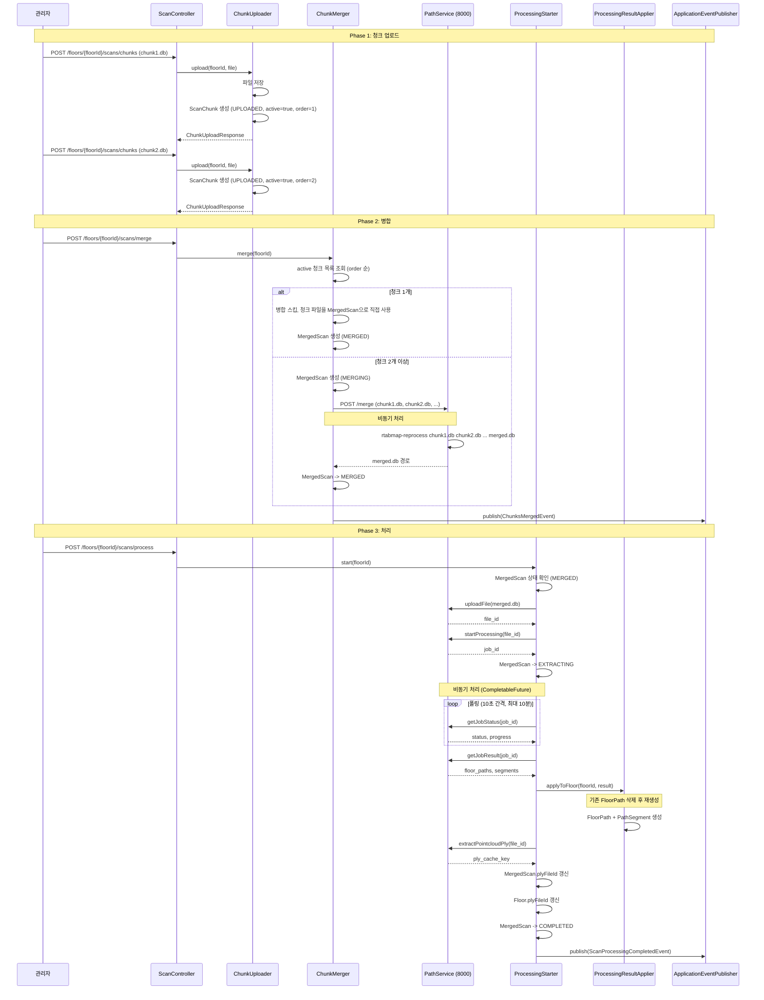
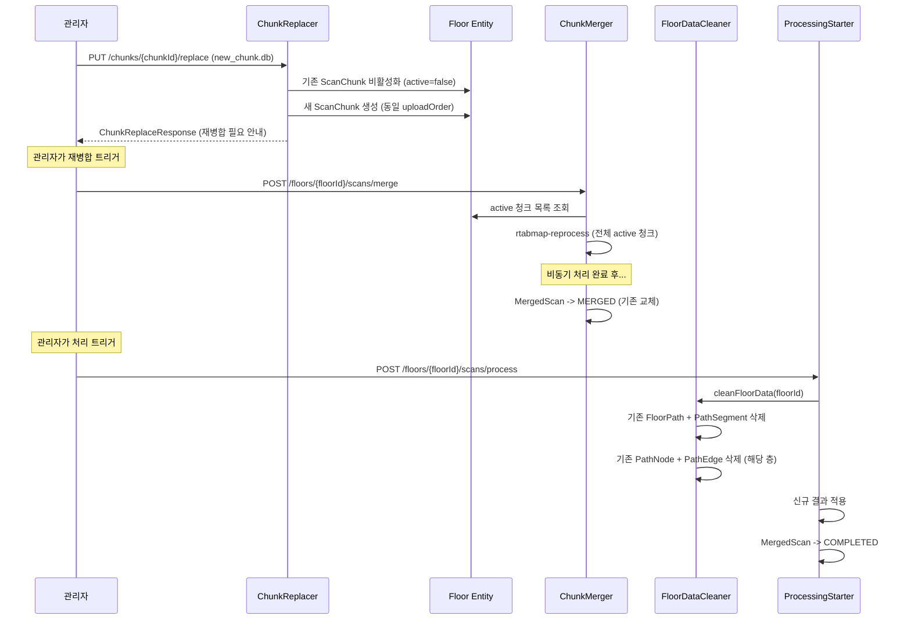
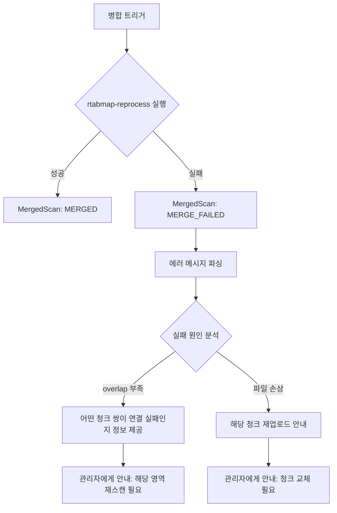
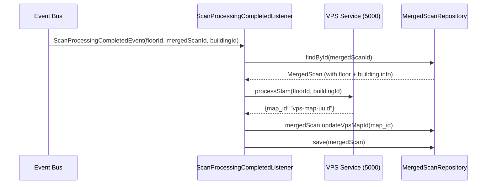

# 03. 처리 파이프라인 변경 상세

> **Backlink:** [00_master_plan.md](./00_master_plan.md)
> **Status:** Proposed
> **Last Updated:** 2026-03-24

---

## 1. Problem Context

현재 파이프라인은 건물 전체 .db를 처리한 후 자동으로 층을 분리(Z-range)하고, 수직통로를 감지하는 흐름이다. 층별 청크 분할 업로드/병합 체계에서는 **병합 단계**가 처리 파이프라인 앞에 추가되며, 층 분리/수직통로 자동 감지는 불필요해진다.

### 현재 파이프라인의 제거/변경 대상

| 단계 | 현재 | 변경 후 |
|------|------|---------|
| 층 자동 분리 | Z-range 기반 자동 층 생성 | **제거** - 층은 관리자가 사전 생성 |
| 수직통로 감지 | 자동 감지 후 VerticalPassage 생성 | **제거** - 관리자 수동 설정 |
| 전체 PLY -> 층별 PLY | Z-range 필터링으로 분리 | **제거** - 병합된 .db에서 직접 추출 |
| VPS 건물 단위 등록 | processSlam(buildingId) | **변경** - 층별 등록 |
| (없음) | - | **추가** - 청크 병합 (rtabmap-reprocess) |

---

## 2. Solution Options

### Option A: Python 서비스 API 변경 최소화 (선택)

Python 서비스는 기존 처리 API를 그대로 사용한다. 병합된 .db는 이미 단일 층 데이터이므로 층 분리 로직은 자연스럽게 "1개 층"만 반환한다. **병합(rtabmap-reprocess)은 Python 서비스에 새 엔드포인트를 추가**하여 처리한다.

| 장점 | 단점 |
|------|------|
| 기존 처리 API 수정 불필요 | 불필요한 층 분리 로직이 실행됨 (성능 영향 미미) |
| 병합 API만 추가 | Python 서비스에 merge 엔드포인트 추가 필요 |

### Option B: Python 서비스 전체 리팩터링

Python 서비스에 `mode=single_floor` + `merge` 모드를 추가하여 전체 흐름 최적화.

| 장점 | 단점 |
|------|------|
| 불필요한 처리 완전 스킵 | Python 서비스 대규모 수정 필요 |
| 최적 성능 | 추가 개발 비용 높음 |

**결정: Option A** - 기존 처리 API는 그대로 유지하고, 병합 전용 엔드포인트만 Python 서비스에 추가한다.

---

## 3. 변경 후 파이프라인

### 3.1 전체 플로우 (청크 업로드 -> 병합 -> 처리 -> VPS)



### 3.2 핵심 변경 포인트

#### ChunkMerger (신규 서비스)

**위치:** `modules/scan/application/service/ChunkMerger.java`

**역할:** Floor의 active 청크들을 병합하여 MergedScan을 생성

**처리 로직:**
1. floorId로 Floor 조회
2. Floor의 active 청크 목록 조회 (uploadOrder 순)
3. 청크 수 검증 (0개이면 에러)
4. 단일 청크 최적화:
   - 청크 1개 -> 병합 스킵, 해당 청크 파일을 MergedScan filePath로 설정
   - MergedScan status: MERGED (MERGING 단계 스킵)
5. 다중 청크 병합:
   - 기존 MergedScan이 있으면 교체 준비
   - MergedScan 생성 (status: MERGING)
   - Python 서비스의 merge 엔드포인트 비동기 호출
   - rtabmap-reprocess 명령: `rtabmap-reprocess chunk1.db chunk2.db ... merged.db`
   - 성공 시: MergedScan status -> MERGED, filePath 갱신
   - 실패 시: MergedScan status -> MERGE_FAILED, errorMessage 설정

#### Python 서비스 병합 API (신규)

```
POST /api/merge
Content-Type: application/json

{
  "chunk_file_paths": [
    "/data/chunks/chunk1.db",
    "/data/chunks/chunk2.db",
    "/data/chunks/chunk3.db"
  ],
  "output_path": "/data/merged/floor_uuid_merged.db"
}

Response:
{
  "status": "success",
  "output_path": "/data/merged/floor_uuid_merged.db",
  "merge_stats": {
    "total_nodes": 1500,
    "total_links": 800,
    "processing_time_seconds": 120
  }
}

Error Response:
{
  "status": "failed",
  "error": "Failed to find enough correspondences between chunk_1 and chunk_3",
  "failed_pairs": [
    {"chunk_a": "chunk1.db", "chunk_b": "chunk3.db", "reason": "insufficient_overlap"}
  ]
}
```

#### ProcessingStarter 변경

```
AS-IS: start(buildingId, sessionId)
TO-BE: start(floorId)
```

**변경 로직:**
1. floorId로 Floor 조회
2. Floor의 MergedScan 조회, MERGED 상태 검증
3. MergedScan의 .db 파일을 Python 서비스에 업로드 + 처리 시작 (기존과 동일)
4. 비동기 처리 완료 대기 (기존과 동일)
5. 결과 적용 시: **해당 Floor에만** FloorPath/PathSegment 생성
6. PLY 추출: 병합된 .db에서 직접 전체 PLY 추출 = 해당 층 PLY

#### ProcessingResultApplier 변경

새 메서드:

```
applyToFloor(UUID floorId, Map<String, Object> result)
```

기존 `apply(sessionId)` 메서드 내에서:
- `applyFloorPath()`: 층 자동 생성 로직 제거. 이미 존재하는 Floor에 FloorPath 적용
- `applyVerticalPassage()`: **호출하지 않음** (자동 감지 제거)

**삭제 대상:**
- `applyVerticalPassage()` 메서드
- `extractFloorPlys()` 메서드 (층별 PLY 분리 불필요)
- Floor 자동 생성 로직 (`floorRepository.save(newFloor)` 부분)

---

### 3.3 부분 업데이트 (청크 교체 후 재병합) 플로우



#### FloorDataCleaner (신규 서비스)

**위치:** `modules/pathprocessing/application/command/FloorDataCleaner.java`

**역할:** 특정 층의 스캔 관련 데이터를 모두 정리 (재처리 전 호출)

**처리 순서 (외래키 의존성 고려):**
1. PathEdge 삭제: 해당 층 PathNode를 from/to로 참조하는 엣지
2. PathNode 삭제: 해당 층의 모든 노드
3. PathSegment 삭제: FloorPath에 소속된 세그먼트 (cascade)
4. FloorPath 삭제 (cascade)

**주의:** VerticalPassage의 PASSAGE_ENTRY/EXIT 노드도 삭제 대상. 처리 완료 후 FloorScanReprocessedEvent 발행하여 수직통로 노드 재생성.

---

### 3.4 병합 실패 처리



**MergeFailureDetail:**

```
record MergeFailureDetail(
    String chunkA,
    String chunkB,
    String reason
)
```

병합 실패 시 MergedScan.errorMessage에 실패 상세를 JSON으로 저장하여 관리자가 조회 가능.

---

### 3.5 PLY 생성 변경

```
AS-IS:
  1. 건물 전체 .db -> 전체 PLY 추출
  2. 전체 PLY -> Z-range 필터링 -> 층별 PLY

TO-BE:
  1. 병합된 .db -> 해당 층 PLY 추출 (단일 단계)
```

- `extractPointcloudPly(file_id)` 호출 결과가 곧 해당 층의 PLY
- `extractFloorPly(sourceCacheKey, minZ, maxZ)` 호출 **제거**
- MergedScan.plyFileId와 Floor.plyFileId에 동일한 cache_key 저장

---

### 3.6 VPS 재등록 플로우



#### 이벤트 변경

```
AS-IS:
  ScanFileUploadedEvent(buildingId)
  -> 업로드 시점에 VPS 등록

TO-BE:
  ScanProcessingCompletedEvent(floorId, mergedScanId, buildingId)
  -> 처리 완료 시점에 VPS 등록
```

**이유:** 업로드 시점에는 아직 병합/처리가 완료되지 않았으므로 VPS에 등록할 데이터가 없다. 처리 완료 후 병합된 .db를 VPS에 전달하여 SLAM 맵을 생성한다.

#### VpsClient 변경

```
AS-IS:
  processSlam(buildingId)  -> /api/slam/process {building_id}

TO-BE:
  processSlamForFloor(floorId, buildingId)  -> /api/slam/process {floor_id, building_id}
```

#### 위치 추정 변경

```
AS-IS:
  localize(mapId, images)  -> 단일 맵에서 매칭

TO-BE:
  localizeAcrossFloors(buildingId, images):
    1. 건물의 모든 Floor 조회
    2. 각 floor의 MergedScan에서 vpsMapId 확인 (없으면 스킵)
    3. 각 floor의 vpsMapId로 VPS localize 병렬 호출
    4. confidence 기준 최고 점수 선택
    5. 선택된 층 + pose + confidence 반환
```

---

## 4. 영향 받는 파일 상세

### scan 모듈

| 파일 | 변경 |
|------|------|
| ChunkUploader.java | **신규** - 청크 업로드 서비스 |
| ChunkMerger.java | **신규** - 청크 병합 서비스 |
| ChunkReplacer.java | **신규** - 청크 교체 서비스 |
| ChunkDeleter.java | **신규** - 청크 삭제 서비스 |
| ScanChunkReader.java | **신규** - 청크 조회 서비스 |
| MergedScanReader.java | **신규** - 병합 결과 조회 서비스 |
| ScanController.java | URL 변경 + 청크/병합/처리 엔드포인트 |
| ScanFileUploader.java | **제거** -> ChunkUploader로 대체 |
| ScanFileUploadedEvent.java | **제거** |
| ScanSessionReader.java | **제거** -> ScanChunkReader, MergedScanReader로 대체 |

### pathprocessing 모듈

| 파일 | 변경 |
|------|------|
| ProcessingStarter.java | MergedScan 기반 처리, floorId 기반 |
| ProcessingResultApplier.java | applyToFloor() 신규, 자동 감지 로직 제거 |
| FloorDataCleaner.java | **신규** - 층별 데이터 정리 |
| ProcessingController.java | URL 변경 (floor 기준) -> ScanController로 통합 가능 |

### localization 모듈

| 파일 | 변경 |
|------|------|
| ScanFileUploadedEventListener.java | ScanProcessingCompletedEvent 리스닝으로 변경 |
| LocalizationService.java | localizeAcrossFloors() 추가, MergedScan.vpsMapId 참조 |
| VpsClient.java | processSlamForFloor() 추가 |
| LocalizeResponse.java | BuildingLocalizeResponse로 교체 |

---

## 5. 신규 도메인 이벤트

### ChunksMergedEvent

```
record ChunksMergedEvent(
    UUID floorId,
    UUID mergedScanId,
    int sourceChunkCount
)
```

**발행 시점:** ChunkMerger의 병합 완료 후 (MergedScan -> MERGED)

**구독자:** (현재 없음. 향후 알림 등 확장용)

### ScanProcessingCompletedEvent

```
record ScanProcessingCompletedEvent(
    UUID floorId,
    UUID mergedScanId,
    UUID buildingId
)
```

**발행 시점:** ProcessingStarter의 비동기 처리 완료 후, 결과 적용 및 PLY 추출 성공 시

**구독자:**
1. `ScanProcessingCompletedEventListener` (localization 모듈): VPS 맵 등록
2. `FloorScanReprocessedEventListener` (pathfinding 모듈): 수직통로 노드 재생성
3. (향후 확장) 알림 서비스, 로그 서비스 등

### FloorScanReprocessedEvent

```
record FloorScanReprocessedEvent(
    UUID floorId,
    UUID mergedScanId
)
```

**발행 시점:** 재처리(기존 데이터 정리 후 새 결과 적용) 완료 후

**구독자:**
1. `FloorScanReprocessedEventListener` (pathfinding 모듈): 해당 층 VerticalPassage의 PathNode 재생성

---

## 6. Milestones

| 단계 | 작업 | 검증 방법 |
|------|------|----------|
| 6.1 | ChunkUploader 구현 | 단위 테스트 |
| 6.2 | ChunkMerger 구현 (단일 청크 스킵 + 다중 청크 병합) | 단위 테스트 + Python 서비스 연동 테스트 |
| 6.3 | Python 서비스 merge 엔드포인트 추가 | Python 단위 테스트 |
| 6.4 | ProcessingStarter MergedScan 기반 변경 | 단위 테스트 |
| 6.5 | ProcessingResultApplier applyToFloor() 구현, 자동 감지 로직 제거 | 단위 테스트 |
| 6.6 | FloorDataCleaner 구현 | 통합 테스트 (DB 정리 확인) |
| 6.7 | ChunkReplacer + ChunkDeleter 구현 | 단위 테스트 |
| 6.8 | PLY 추출 단순화 | E2E 테스트 |
| 6.9 | 이벤트 변경 (ScanProcessingCompletedEvent, ChunksMergedEvent) | 이벤트 발행/구독 테스트 |
| 6.10 | VpsClient 층별 등록 변경 | 통합 테스트 (VPS 서비스 mock) |
| 6.11 | LocalizationService 병렬 매칭 구현 | 단위 테스트 (CompletableFuture 검증) |
| 6.12 | 병합 실패 처리 + 에러 파싱 | 단위 테스트 |

---

## 7. Risks & Constraints

| 리스크 | 대응 |
|--------|------|
| Python rtabmap-reprocess가 대용량 청크에서 오래 걸림 | 비동기 처리 + 폴링. 타임아웃 30분 이상 설정. 진행률 제공 |
| Python 서비스가 단일 층 .db에서 여러 층을 감지하는 경우 | 결과의 첫 번째 floor_path만 사용. Python 응답의 floor_level 무시 |
| 병합 시 overlap 부족으로 실패 빈도 높음 | 에러 메시지에서 실패 청크 쌍 정보 파싱, 관리자에게 구체적 안내 제공 |
| CompletableFuture 비동기 처리 중 트랜잭션 범위 | @Transactional 서비스를 별도 빈으로 분리하여 비동기 스레드에서 호출 |
| VPS 서비스 floor_id 기반 변경 미지원 시 | building_id + floor_level 조합으로 맵 키 구성 가능 (fallback) |
| 재처리 중 PathNode/PathEdge 삭제 시 진행 중인 pathfinding 요청 | 관리자 전용 기능이므로 동시성 문제 낮음. 필요시 pessimistic lock |
| 병합 결과 파일 누적으로 디스크 공간 부족 | 이전 MergedScan 파일 자동 정리 정책 (새 병합 성공 시 이전 파일 삭제) |
