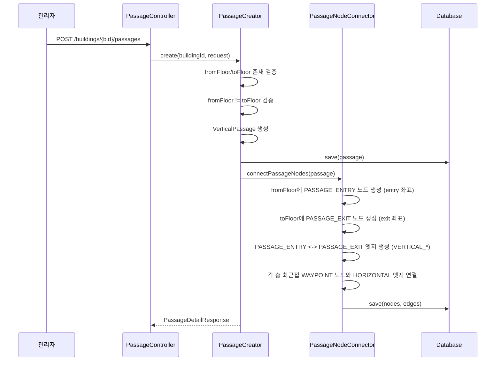
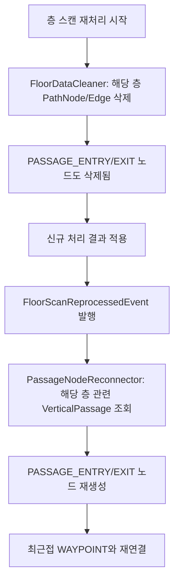

# 04. 수직통로 수동 관리 설계

> **Backlink:** [00_master_plan.md](./00_master_plan.md)
> **Status:** Proposed
> **Last Updated:** 2026-03-24

---

## 1. Problem Context

현재 수직통로(VerticalPassage)는 Python 서비스의 자동 감지에 의존한다. 스캔 품질, 계단 형태, 엘리베이터 구조에 따라 감지 정확도가 불안정하다. 층별 청크 분할 업로드/병합 체계에서는 각 층이 독립적으로 스캔되므로 단일 .db에 여러 층이 포함되지 않아 자동 감지 자체가 불가능해진다.

### 제약 조건

- 수직통로는 반드시 서로 다른 두 층을 연결해야 한다
- entry/exit 좌표는 각 층의 좌표계에서의 위치이다
- PathNode(PASSAGE_ENTRY/EXIT)와 PathEdge(VERTICAL_*)를 통해 경로 탐색 그래프에 통합되어야 한다
- 기존 passage 모듈의 조회 기능은 유지

---

## 2. Solution Options

### Option A: 수동 좌표 입력 방식 (선택)

관리자가 직접 entry/exit 좌표와 통로 타입을 입력한다. 프론트엔드에서 층별 PLY/지도 위에 클릭하여 좌표를 지정할 수 있도록 한다.

| 장점 | 단점 |
|------|------|
| 구현 단순 | 관리자의 좌표 입력 부담 |
| 정확한 위치 보장 | 프론트엔드 UX 개선 필요 |
| Python 서비스 의존성 없음 | - |

### Option B: 반자동 감지 (관리자 확인 후 적용)

Python 서비스가 후보 통로를 제안하고 관리자가 확인/수정 후 적용.

| 장점 | 단점 |
|------|------|
| 관리자 부담 감소 | 층별 독립 .db에서는 감지 자체가 불가 |
| - | Python 서비스 추가 개발 필요 |

**결정: Option A** - 층별 독립 .db(청크 병합 결과) 체계에서 자동 감지가 근본적으로 불가능하므로 수동 입력이 유일한 선택지.

---

## 3. VerticalPassage 엔티티 변경

### 제거 대상

| 필드/관계 | 제거 이유 |
|----------|----------|
| pathGeometry (LineString) | 자동 감지된 3D 경로 기하. 수동 설정에서는 entry/exit 좌표만 필요 |
| segments (OneToMany PathSegment) | 자동 감지된 경로 세그먼트. 불필요 |

### 추가 대상

| 필드 | 타입 | 설명 |
|------|------|------|
| name | String | 관리자 식별용 이름 (예: "중앙 계단", "엘리베이터 A") |

### 유지 대상

| 필드 | 설명 |
|------|------|
| building (ManyToOne) | 건물 소속 |
| type (PassageType) | STAIRS / ELEVATOR |
| fromFloor (ManyToOne) | 출발 층 |
| toFloor (ManyToOne) | 도착 층 |
| entryX, entryY, entryZ | 출발 층의 통로 입구 좌표 |
| exitX, exitY, exitZ | 도착 층의 통로 출구 좌표 |

---

## 4. CRUD 흐름

### 4.1 수직통로 생성



### 4.2 PassageNodeConnector (신규 서비스)

**위치:** `modules/passage/application/command/PassageNodeConnector.java`

**역할:** VerticalPassage 생성/수정/삭제 시 관련 PathNode와 PathEdge를 자동 관리

#### 생성 시 (connectPassageNodes)

1. fromFloor에 PASSAGE_ENTRY PathNode 생성
   - 좌표: (entryX, entryY, entryZ)
   - type: PASSAGE_ENTRY
   - verticalPassage: 해당 Passage 참조
2. toFloor에 PASSAGE_EXIT PathNode 생성
   - 좌표: (exitX, exitY, exitZ)
   - type: PASSAGE_EXIT
   - verticalPassage: 해당 Passage 참조
3. PASSAGE_ENTRY <-> PASSAGE_EXIT 간 PathEdge 생성
   - edgeType: type == STAIRS ? VERTICAL_STAIRCASE : VERTICAL_ELEVATOR
   - isBidirectional: true
   - distance: 3D 유클리드 거리
4. 각 층에서 **최근접 WAYPOINT 노드** 탐색 후 HORIZONTAL 엣지 연결
   - fromFloor의 WAYPOINT 중 PASSAGE_ENTRY와 가장 가까운 노드와 연결
   - toFloor의 WAYPOINT 중 PASSAGE_EXIT와 가장 가까운 노드와 연결
   - 해당 층에 WAYPOINT가 없으면 연결 스킵 (나중에 관리자가 그래프 편집)

#### 수정 시 (updatePassageNodes)

1. 기존 PASSAGE_ENTRY/EXIT 노드의 좌표 업데이트
2. 관련 엣지의 distance 재계산
3. 최근접 WAYPOINT 재탐색 후 엣지 재연결

#### 삭제 시 (disconnectPassageNodes)

1. 해당 Passage에 연결된 PathEdge 모두 삭제
2. PASSAGE_ENTRY/EXIT PathNode 삭제

---

## 5. 도메인 이벤트

### PassageCreatedEvent

```
record PassageCreatedEvent(
    UUID passageId,
    UUID buildingId,
    UUID fromFloorId,
    UUID toFloorId
)
```

**발행 시점:** VerticalPassage 저장 후

**구독자:** PassageNodeConnector (pathfinding 모듈)

> **모듈 간 통신 원칙 준수:** passage 모듈에서 pathfinding 모듈의 PathNode/PathEdge를 직접 조작하지 않는다. 이벤트를 발행하고, pathfinding 모듈의 리스너가 노드/엣지를 관리한다.

### PassageUpdatedEvent

```
record PassageUpdatedEvent(
    UUID passageId,
    Double entryX, Double entryY, Double entryZ,
    Double exitX, Double exitY, Double exitZ
)
```

### PassageDeletedEvent

```
record PassageDeletedEvent(
    UUID passageId
)
```

---

## 6. 이벤트 리스너 (pathfinding 모듈)

**위치:** `modules/pathfinding/application/event/PassageEventListener.java`

```
@Component
@RequiredArgsConstructor
public class PassageEventListener {

    private final PassageNodeConnector passageNodeConnector;

    @TransactionalEventListener(phase = AFTER_COMMIT)
    public void handlePassageCreated(PassageCreatedEvent event) {
        passageNodeConnector.connectPassageNodes(event.passageId());
    }

    @TransactionalEventListener(phase = AFTER_COMMIT)
    public void handlePassageUpdated(PassageUpdatedEvent event) {
        passageNodeConnector.updatePassageNodes(event.passageId());
    }

    @TransactionalEventListener(phase = AFTER_COMMIT)
    public void handlePassageDeleted(PassageDeletedEvent event) {
        passageNodeConnector.disconnectPassageNodes(event.passageId());
    }
}
```

---

## 7. 스캔 재처리 시 영향

특정 층의 스캔이 재처리되면(청크 교체 -> 재병합 -> 재처리) 해당 층의 모든 PathNode가 삭제된다. 이때 PASSAGE_ENTRY/EXIT 노드도 삭제 대상이다.

### 재처리 후 복구 흐름



**위치:** `modules/pathfinding/application/event/FloorScanReprocessedEventListener.java`

이 리스너는 FloorScanReprocessedEvent를 수신하여 해당 층에 관련된 모든 VerticalPassage의 PathNode를 재생성한다.

### 복구 대상 이벤트 체인

```
청크 교체 -> 재병합 트리거 -> MergedScan 교체
-> 처리 트리거 -> FloorDataCleaner (기존 데이터 정리)
-> 새 결과 적용 -> ScanProcessingCompletedEvent 발행
-> VPS 재등록 + FloorScanReprocessedEvent 발행
-> 수직통로 노드 재생성
```

---

## 8. 검증 규칙

### 생성 시 검증

| 규칙 | 에러 코드 |
|------|----------|
| fromFloor와 toFloor가 같은 건물에 속해야 함 | VP003 |
| fromFloor와 toFloor가 달라야 함 | VP002 |
| fromFloor, toFloor가 존재해야 함 | FLOOR_NOT_FOUND |
| 동일 층 쌍 + 동일 타입의 중복 통로 경고 (허용은 함) | - |
| entry/exit 좌표가 유효한 범위인지 (null 불가) | INVALID_INPUT_VALUE |

### 수정 시 검증

| 규칙 | 에러 코드 |
|------|----------|
| fromFloor/toFloor 변경 시 동일 건물 소속 검증 | VP003 |
| 좌표 변경 시 PathNode/Edge 자동 갱신 | - |

---

## 9. Milestones

| 단계 | 작업 | 검증 방법 |
|------|------|----------|
| 9.1 | VerticalPassage 엔티티 정리 (segments, pathGeometry 제거, name 추가) | 컴파일 + DB 마이그레이션 |
| 9.2 | PassageCreator, PassageUpdater, PassageDeleter 서비스 작성 | 단위 테스트 |
| 9.3 | PassageController CRUD 엔드포인트 추가 | E2E 테스트 |
| 9.4 | 도메인 이벤트 + PassageEventListener 구현 | 이벤트 발행/구독 테스트 |
| 9.5 | PassageNodeConnector 구현 (노드/엣지 자동 관리) | 통합 테스트 |
| 9.6 | FloorScanReprocessedEventListener 구현 (재처리 후 재연결) | 통합 테스트 |
| 9.7 | ProcessingResultApplier에서 자동 감지 코드 제거 | 기존 테스트 통과 확인 |

---

## 10. Risks & Constraints

| 리스크 | 대응 |
|--------|------|
| 관리자가 잘못된 좌표 입력 시 경로 탐색 불가 | 프론트엔드에서 PLY 뷰어 위 클릭으로 좌표 입력 유도. 백엔드에서는 좌표 범위 검증만 |
| 최근접 WAYPOINT 연결이 벽을 통과할 수 있음 | 1차 구현에서는 직선 거리 기반 연결. 향후 장애물 회피 경로 탐색으로 개선 가능 |
| 스캔 재처리 후 PASSAGE 노드 재생성 시 좌표 불일치 | entry/exit 좌표는 VerticalPassage에 저장되므로 재생성 시 동일 좌표 사용. 단, 새 스캔(병합 결과)의 좌표계가 다를 수 있으므로 관리자 확인 필요 |
| 이벤트 리스너 실패 시 노드 미생성 | @TransactionalEventListener 사용. 실패 시 로그 + 재시도 가능하도록 수동 트리거 API 제공 |
| 청크 교체 후 재병합 시 좌표계 변동 가능성 | 새로 병합된 결과의 좌표계가 이전과 달라질 수 있음. 관리자에게 수직통로 좌표 재확인 안내 |
